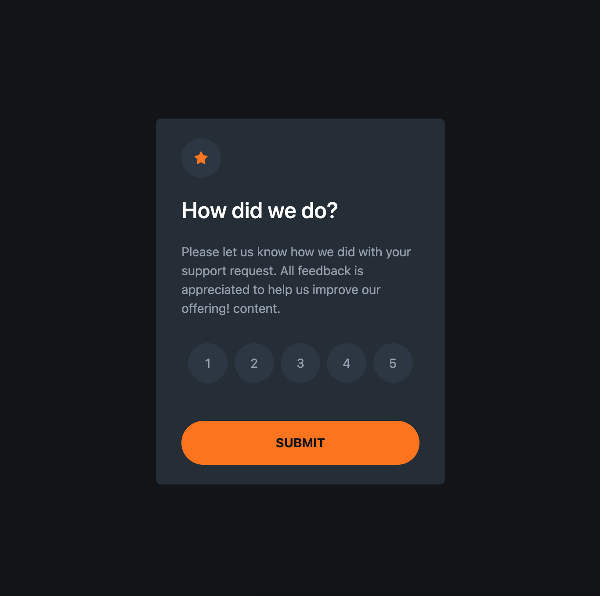

# Frontend Mentor - Interactive rating component solution

This is a solution to the [Interactive rating component challenge on Frontend Mentor](https://www.frontendmentor.io/challenges/interactive-rating-component-koxpeBUmI). Frontend Mentor challenges help you improve your coding skills by building realistic projects. 

## Table of contents

- [Overview](#overview)
  - [The challenge](#the-challenge)
  - [Screenshot](#screenshot)
  - [Links](#links)
- [My process](#my-process)
  - [Built with](#built-with)
  - [What I learned](#what-i-learned)
  - [Continued development](#continued-development)
  - [Useful resources](#useful-resources)
- [Author](#author)
- [Acknowledgments](#acknowledgments)

**Note: Delete this note and update the table of contents based on what sections you keep.**

## Overview

### The challenge

Users should be able to:

- View the optimal layout for the app depending on their device's screen size
- See hover states for all interactive elements on the page
- Select and submit a number rating
- See the "Thank you" card state after submitting a rating

### Screenshot

### Links

- Solution URL: [Add solution URL here](https://your-solution-url.com)
- Live Site URL: [Add live site URL here](https://your-live-site-url.com)

## My process
First, I watched a few tutorials on bootstrap and read the documentation as I wanted to experiment with this to create a responsive layout.

Then I started with the html adding the bootstrap container, row and columns. Then I added the styles, padding and colors to the elements.

### Built with

- Semantic HTML5 markup
- CSS custom properties
- Bootstrap
- Mobile-first workflow

### What I learned

I learnt about creating responsive layouts using the bootstrap grid system. I would like to explore this more in future projects. I was able to practice some concepts in JavaScript such as manipulating the DOM, using querySelector, Foreach loops and eventListener.

### Continued development

I want to continue mastering the techniques I haved used in this project. It took me a while to build so I would liek to improve my use of time.

### Useful resources

- [Example resource 1](https://www.youtube.com/watch?v=cQnUopEeZgw) - This helped me to come up with the idea of adding avote again button
- [Example resource 2](https://www.youtube.com/watch?v=Jyvffr3aCp0) - This is a great tutorial I used to help me understand Bootstrap along with the official docs.

## Author

- Website - [Add your name here](https://www.your-site.com)
- Frontend Mentor - [@yourusername](https://www.frontendmentor.io/profile/yourusername)
- Twitter - [@yourusername](https://www.twitter.com/yourusername)

**Note: Delete this note and add/remove/edit lines above based on what links you'd like to share.**

## Acknowledgments

Thank you to Skillcrush, Frontend Queens for assigning this as part of our JavaScript Study group and my lovely tutor Sarah Soutoul who is patiently helping me with JavaScript foundations line by line.
